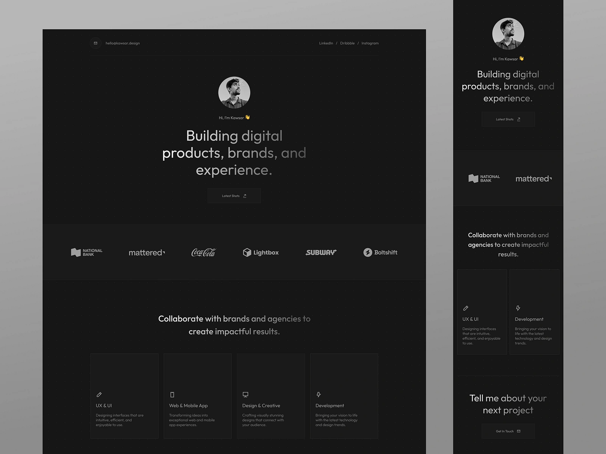

# react-portfoli-tailwindcss-framer-motion

A modern portfolio website built with React, Vite, Tailwind CSS, and Framer Motion animations.

## Features

- ⚡ Fast development with Vite
- 🎨 Styled with Tailwind CSS
- ✨ Smooth animations with Framer Motion
- 📱 Fully responsive design
- ⚙️ Easy to customize

## Technology Stack

- **Vite** - Next generation frontend tooling
- **React** - JavaScript library for UI
- **Tailwind CSS** - Utility-first CSS framework
- **Framer Motion** - Animation library for React
- **JavaScript (ES6+)**

## Installation

1. Clone the repository:
   git clone https://github.com/aminulislam92/react-portfoli-site.git
   cd react-portfoli-site

2. Install dependencies:
   npm install or yarn install
3. Start the development server:
   npm run dev or yarn dev
4. Open your browser and navigate to http://localhost:3000 to see the portfolio website in action.

## Customization

To customize the portfolio website, you can modify the following files:

- `src/App.jsx`: Main application component where you can add your projects, skills, and other sections.
- `src/components/`: Directory containing reusable components like Navbar, Footer, ProjectCard, etc.
- `src/assets/`: Directory for images, icons, and other assets used in the website.
- `tailwind.config.js`: Tailwind CSS configuration file for customizing the design system.

## Deployment

To deploy the portfolio website, you can use platforms like Vercel, Netlify, or GitHub Pages. Follow the deployment instructions for your chosen platform to get your portfolio live on the web.

## Contributing

Contributions are welcome! If you have any suggestions or improvements, please feel free to open an issue or submit a pull request.

## License

This project is licensed under the MIT License. See the [LICENSE](LICENSE) file for details.

## Contact

If you have any questions or want to get in touch, feel free to reach out via email at [aminulsohag10292@gmail.com](mailto:aminulsohag10292@gmail.com) or connect with me on [LinkedIn](https://www.linkedin.com/in/aminul-islam-b1175aa4/).  
Thank you for checking out my portfolio website! I hope you find it useful and inspiring.
